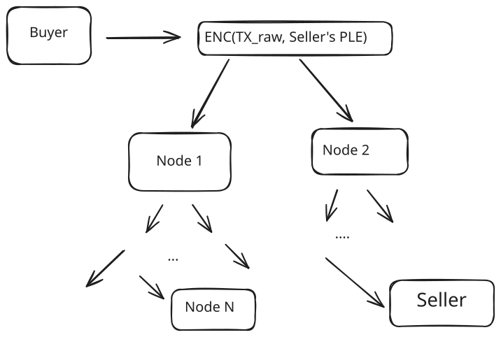
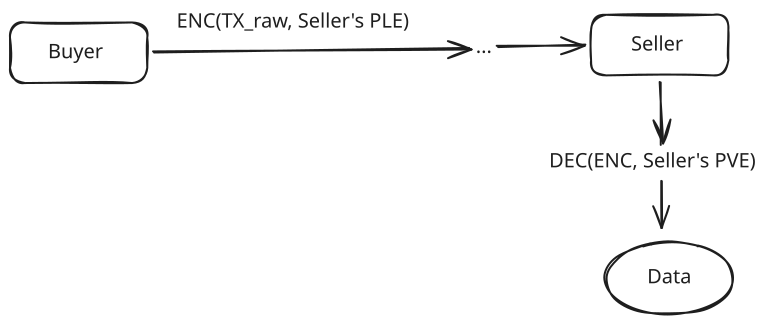

### Silkium
Author: Alice Evenander - Phan Minh Thiên Hoàng
Date: 30/4/2026, lúc 19h33 phút cùng ngày


# Lời nói đầu 
Vào khoảng 2009, Satoshi Nakamoto giới thiệu mô hình Bitcoin, mô hình tiền ảo với phương châm theo đuổi chân lý phân tán hoàn toàn(decentralized system) trong đó đề cập đến việc xem tiền tệ như một đơn vị phi tập trung(tức rằng không bị ràng buộc bởi các cơ chế chính phủ hiện hành). Năm 2015, lập trình viên gốc Nga người Canada Vitalik Buterin vận hành một hệ thống tiền tệ tương tự với Bitcoin, nhưng trong đó áp dụng các công nghệ Smart Contract và cơ chế PoS(Proof of Stake) đối lập với tính bảo thủ của Bitcoin. Đó là hai ví dụ rất tốt về một mô hình phân tán hoàn toàn, dẫu vậy những dạng mô hình được đề cập ở trên chỉ dừng lại trong khuôn khổ tài chính chứ chưa được phổ biến rộng rãi qua các lĩnh vực khác.

Thương mại điện tử hiện đại phụ thuộc vào các nền tảng trung gian tập trung, nơi phí cao, hệ thống xếp hạng dễ bị làm giả qua giao dịch ảo, review farm và tối ưu nội bộ nền tảng, seller chịu chi phí nền tảng cao và phụ thuộc thuật toán phân phối traffic, buyer thường phải cung cấp danh tính, địa chỉ, lịch sử mua sắm và dữ liệu hành vi cho nền tảng trung gian.

Nhận thấy đặc điểm đó, một mô hình mạng phân tán trong lĩnh vực thương mại, Silkium, được giới thiệu, trong đó được kì vọng giải quyết các vấn đề hiện hữu của đa số các sàn thương mại điện tử lúc bấy giờ:
- Phí trung gian cao(khoảng 8%-15% tùy vào sàn)
- Uy tín bị nâng một cách vô lý do sự xuất hiện của các đơn mua hàng ảo bởi các tài khoản ảo
- Quyền sở hữu và thêm các luật thuộc về chủ của hệ thống chứ không phải từ ý kiến đa số của người dùng
- Sự cạnh tranh thiếu công bằng(bằng các thủ thuật được đề cập ở trên) giữa các người bán 

Vì vậy, Silkium được thiết kế để giảm thiểu những vấn đề này thông qua kiến ​​trúc phi tập trung, xác minh mật mã, ký quỹ và mô hình uy tín dựa trên hành vi có trọng số thay vì chỉ dựa trên số lượng tương tác thông thường. Tất cả điều đó sẽ được giới thiệu ở phần sau nữa của văn bản

# Mục lục
- Lời nói đầu
- 1. Kiến trúc của Silkium
    - a. Cấu trúc cơ bản
        - Quy ước
        - Cơ chế mua bán
        - Cơ chế đăng bán 
    - b. Blockchain
        - b.1. Transaction chain
        - b.2. Market chain
    - c. Cơ chế Weight
    - d. Mạng
    - e. Money Pool và Information Pool
- 2. Các khái niệm được sử dụng 
    - a. Mã hóa và xác minh danh tính bằng RSA(X25519) và EdDSA(Ed25519)
    - b. Phương thức PoS(Proof of Stake) trong việc xác minh tính chính xác của thông tin 
    - c. DNS 
    - d. Cơ chế code xác nhận(*State Code*)
    - e. Cơ chế tính toán trọng số weight W
    - f. Máy tìm kiếm
    - g. Blockchain
- 3. Vấn đề về lưu trữ chuỗi blockchain
- 4. Định hướng phát triển


## 1. Kiến trúc của Silkium 
# a. Cấu trúc cơ bản
Lưu ý quan trọng nhất của toàn bộ hệ thống chính là việc blockchain lưu trữ dữ liệu các lần mua hàng(TransactionBlockchain) và blockchain lưu trữ lịch sử đăng bán món hàng(MarketBlockchain) được phân biệt riêng. Xem phần b. để hiểu rõ điều này

# Quy ước

Đầu tiên ta gọi:
```text
PVS : Private key dùng cho việc kí
PLS : Public key dùng cho việc kí
PVE : Private key dùng cho việc mã hóa
PLE : Public key dùng cho việc mã hóa
```

Đó sẽ là công cụ để ta triển khai kĩ lưỡng ý tưởng của Silkium. Chúng thực hiện nhiệm vụ bảo đảm tính toàn vẹn và tính xác minh mà không tiết lộ thông tin nhạy cảm của người dùng(ví dụ như địa chỉ IP, các thông tin cá nhân khác, etc.)

Tiếp túc gọi:
```text
TX : nội dung của một lần mua hàng dưới dạng một block trong blockchain
TX_raw: thông tin được trao đổi giữa người mua và bán(có thể hiểu như nội dung đơn hàng)
SIGN(<Nội dung>, <PVS>): kí một thông tin để truyền đi, mục đích giúp xác minh danh tính người gửi
VRF(<Nội dung>,<Chữ kí>,<PLS>): Trong đó thể hiện việc truyền thông tin đã được xác nhận của người dùng có PLS tương ứng
ENC(<Nội dung>, <PLE>): mã hóa thông tin từ PLE của người nhận
DEC(<Nội dung>, <PVE>): giải mã thông tin từ kết quả của hàm ENC
```

Trong đó TX chứa đựng các thông tin sau đây:
```text
- previous_block : Là block nằm trong blockchain mà khi TX được thêm vào blockchain thì block này sẽ nằm ngay trước previous block
- epoch: Thời gian mà block này được sinh ra dưới dạng epoch
- information_hash: 
    - là kết quả của hàm ```text
        hash(item, quantity)``` 
    - Trong đó:
        + item: là *node id* của món hàng đó trong MarketBlockchain lưu
        + quantity: là số lượng món hàng đó mà người dùng mua 
- buyer_signed_information_hash: là kết quả của SIGN(information_hash,PVS của người mua)
- seller_signed_information_hash: là kết quả của SIGN(information_hash,PVS của người bán)
- transaction_code : Là *State Code* của đơn hàng(giải thích ở phần 2.d và các phần sau)
- buyer_signature_public_key: PLS của người mua
- seller_signature_public_key: PLS của người bán
```

TX_raw chứa các thông tin:
```text
item : là *node id* của món hàng đó trong MarketBlockchain lưu
place : một địa điểm cụ thể, lưu ý phải đủ cụ thể để người bán có thể đặt món hàng
epoch : Thời gian mà thông tin này được sinh ra dưới dạng epoch
note : các ghi chú(dưới 100 kí tự)
```

# Cơ chế mua bán
Ta cần phải làm rõ:
- Để hạn chế việc lộ địa chỉ IP của người mua và người bán, Silkium không sử dụng kết nối trực tiếp giữa hai bên. Thay vào đó, thông tin được truyền qua một lớp trung gian gồm nhiều node trong mạng (relay layer), trong đó mỗi node chỉ biết node trước và node sau trong chuỗi truyền tin.

-Cơ chế này tương tự nguyên lý của Tor, trong đó thông điệp được mã hóa nhiều lớp và truyền qua nhiều node trung gian, giúp giảm khả năng truy vết nguồn gốc ban đầu.



- Để giữ cho mọi thứ đơn giản ta thu gọn quá trình này lại thành như sau:


- Thay vì thiết lập kết nối trực tiếp giữa người mua và người bán, người mua truyền thông điệp qua nhiều node trung gian trong mạng cho đến khi đơn hàng (TX_raw) tới người bán (Xem Picture 1 và Picture 2). Thông điệp được gửi đi từ người mua là:
    ```text
    ENC(TX_raw, PLE của người bán), PLE của người bán
    ```

- Lúc này người bán đọc thông tin bằng cách đọc kết quả của hàm
    ```text
    DEC(kết quả ENC nhận được, PVE của người bán)
    ```

- Sau khi đã xác nhận deal:
    + Người mua chuyển 100% số tiền phải trả vào Money Pool (xem ở phần e.).
    + Người bán phải chuyển một khoản tiền ký quỹ (stake) vào Money Pool để đảm bảo trách nhiệm giao dịch.
    + Giá trị stake của người bán không cố định mà phụ thuộc vào độ uy tín (weight W) của người bán trong hệ thống. Người bán có độ uy tín cao sẽ yêu cầu mức stake thấp hơn, trong khi người bán mới hoặc có độ uy tín thấp sẽ phải stake nhiều hơn.
    + Vì loại tiền tệ được quy định để sử dụng là Ethereum, hệ thống sử dụng Smart Contract để giám sát việc chuyển tiền của cả hai bên vào ví escrow (Money Pool). Khi đã xác nhận được tiền đã được chuyển đầy đủ, giao dịch sẽ chuyển sang bước tiếp theo.
    + Trong trường hợp quá thời gian 2 ngày kể từ khi một bên chuyển tiền mà bên còn lại không hoàn tất nghĩa vụ của mình, giao dịch sẽ bị hủy và số tiền đã gửi sẽ được hoàn trả lại cho bên đã thực hiện chuyển tiền.


